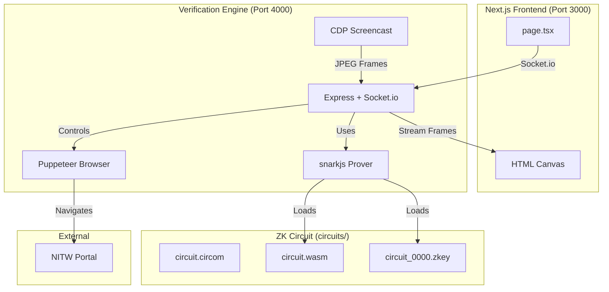
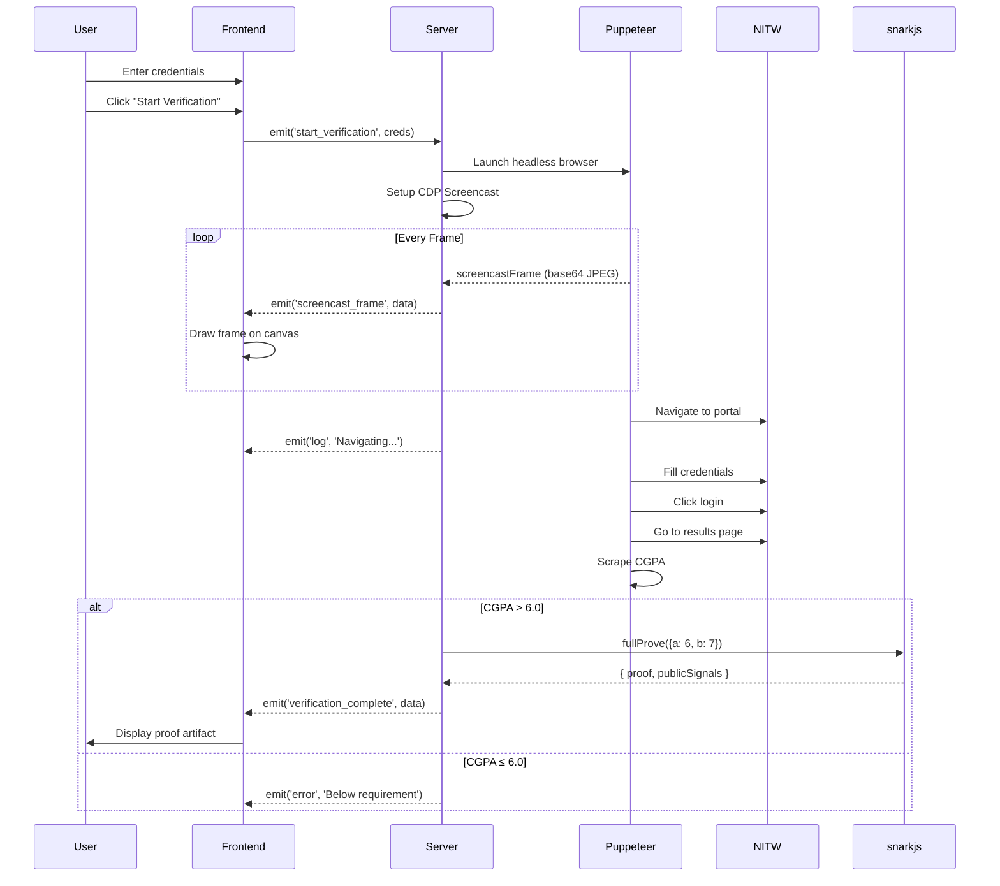

# AstraVerify Codebase Summary

## Project Overview

**AstraVerify** is a Zero-Knowledge (ZK) verification proof-of-concept that demonstrates a "Wizard of Oz" architecture for verifying student CGPA from the NIT Warangal (NITW) student portal with live browser streaming.

---

## Architecture



---

## Technology Stack

| Layer | Technology | Version |
|-------|------------|---------|
| Frontend | Next.js + React | 16.1.0 / 19.2.3 |
| Styling | Tailwind CSS | 4.x |
| Backend | Express + Socket.io | 5.2.1 / 4.8.1 |
| Browser Automation | Puppeteer | 24.34.0 |
| ZK Proofs | snarkjs (Groth16) | 0.7.5 |
| Circuit Language | Circom | 2.0.0 |

---

## Directory Structure

```
generateproof/
├── app/                          # Next.js App Router
│   ├── page.tsx                  # Main verification UI (203 lines)
│   ├── globals.css               # Tailwind + custom animations
│   ├── layout.tsx                # Root layout
│   └── favicon.ico
├── circuits/                     # ZK Circuit artifacts
│   ├── circuit.circom            # Source circuit (a * b = c)
│   ├── circuit.r1cs              # Rank-1 Constraint System
│   ├── circuit.sym               # Symbol table
│   ├── circuit_0000.zkey         # Proving key (2.5 KB)
│   ├── verification_key.json     # Public verification key
│   ├── circuit_js/               # WASM prover
│   │   └── circuit.wasm
│   ├── pot12_*.ptau              # Powers of Tau files
│   ├── proof.json                # Sample proof output
│   └── public.json               # Sample public signals ["42"]
├── verification-server.js        # Backend verification engine (146 lines)
├── package.json                  # Dependencies
├── plan.md                       # Implementation plan
└── ...config files
```

---

## Core Components

### 1. Verification Server (`verification-server.js`)

The heart of the system - a Node.js server that:

| Function | Description |
|----------|-------------|
| **Socket.io Server** | Listens on port 4000, handles bidirectional real-time communication |
| **CDP Screencast** | Captures browser frames via Chrome DevTools Protocol and streams to frontend |
| **Puppeteer Automation** | Logs into NITW portal, navigates to results page, scrapes CGPA |
| **ZK Proof Generation** | Uses snarkjs to generate Groth16 proofs |

**Key Flow:**
```
start_verification → Launch Browser → Setup Screencast → Login → Scrape CGPA → Generate Proof → Emit Result
```

**NITW Portal Selectors (verified):**
```javascript
'#login input[name="username"]'  // Registration number
'#login input[name="passw"]'     // Password (note: 'passw')
'#login input[type="submit"]'    // Login button
```

---

### 2. Frontend (`app/page.tsx`)

A React client component with:

| Feature | Implementation |
|---------|----------------|
| **Socket Connection** | Connects to `localhost:4000`, tracks connection state |
| **Live Canvas** | 640×360 canvas renders base64 JPEG frames from CDP screencast |
| **Credential Form** | Username/password inputs with validation |
| **Activity Log** | Timestamped log of all verification steps |
| **Proof Display** | Shows CGPA, public signals, and full Groth16 proof JSON |

**State Management:**
```typescript
creds: { username, password }
logs: string[]
status: string
proofData: { success, cgpa, proof, publicSignals }
isConnected: boolean
isVerifying: boolean
```

---

### 3. ZK Circuit (`circuits/circuit.circom`)

A **dummy factorization circuit** for PoC purposes:

```circom
template Multiplier() {
    signal input a;      // Private input 1
    signal input b;      // Private input 2
    signal output c;     // Public output
    
    c <== a * b;         // Constraint: a * b = c
}
```

**Circuit Properties:**
| Property | Value |
|----------|-------|
| Protocol | Groth16 |
| Curve | BN128 |
| Private Inputs | 2 (a, b) |
| Public Outputs | 1 (c = a × b) |
| Non-linear Constraints | 1 |

**Test Proof:**
- Inputs: `a = 6, b = 7`
- Public Signals: `["42"]`

---

## Data Flow



---

## Running the Application

### Prerequisites
- Node.js 18+
- Circom 2.0+ (Rust version)
- Chrome/Chromium (for Puppeteer)

### Start Commands

**Terminal 1 - Verification Engine:**
```bash
node verification-server.js
# Output: Verification Engine running on port 4000
```

**Terminal 2 - Frontend:**
```bash
npm run dev
# Output: Ready on http://localhost:3000
```

---

## Key Dependencies

```json
{
  "dependencies": {
    "express": "^5.2.1",
    "socket.io": "^4.8.1",
    "socket.io-client": "^4.8.1",
    "puppeteer": "^24.34.0",
    "snarkjs": "^0.7.5",
    "cors": "^2.8.5",
    "next": "16.1.0",
    "react": "19.2.3"
  }
}
```

---

## ZK Artifacts for Phase 2

### Verification Key (`circuits/verification_key.json`)

```json
{
 "protocol": "groth16",
 "curve": "bn128",
 "nPublic": 1,
 "vk_alpha_1": [
  "18932601842866783683267886228753043119924025071369735497850794782599386472013",
  "7219823653143110076189775242389213555903276314143203542522976875611237285885",
  "1"
 ],
 "vk_beta_2": [
  ["6202389737555149701399302424735900365564919489646501128022155611659302686728",
   "2931166165863778782056004220942284282545937603578646099244471653110713002342"],
  ["3428855674821562571041678976893833606408036758761740843655398461949033530602",
   "1287774865022637229424098484206440603842857939160701969215029421777186736189"],
  ["1", "0"]
 ],
 "IC": [
  ["4166447862641313374385797993434016937443700454604970528911241364242968673125",
   "12261980361910384868952347116852375607366594354159158013514583552676179115701", "1"],
  ["21414759274630341990120694726498132838394059140353777588726816612523357609342",
   "8730109451870322798494946579479540298858150340920292553794852811754496380605", "1"]
 ]
}
```

### Public Signals
```json
["42"]
```
(Result of `6 × 7 = 42` - the dummy proof inputs)

---

## Security Notes

> ⚠️ **PoC Limitations**
> - Credentials are transmitted in plaintext over WebSocket
> - No HTTPS/WSS in development mode
> - The ZK proof is a "cryptographic receipt" - actual CGPA verification happens server-side (Wizard of Oz pattern)

---

## Files Summary

| File | Lines | Purpose |
|------|-------|---------|
| `verification-server.js` | 146 | Backend with Puppeteer + snarkjs + Socket.io |
| `app/page.tsx` | 203 | React frontend with live canvas and proof display |
| `circuits/circuit.circom` | 27 | Dummy multiplier circuit (a × b = c) |
| `circuits/verification_key.json` | 94 | Public key for on-chain verification |
| `package.json` | 34 | Project configuration and dependencies |
